

  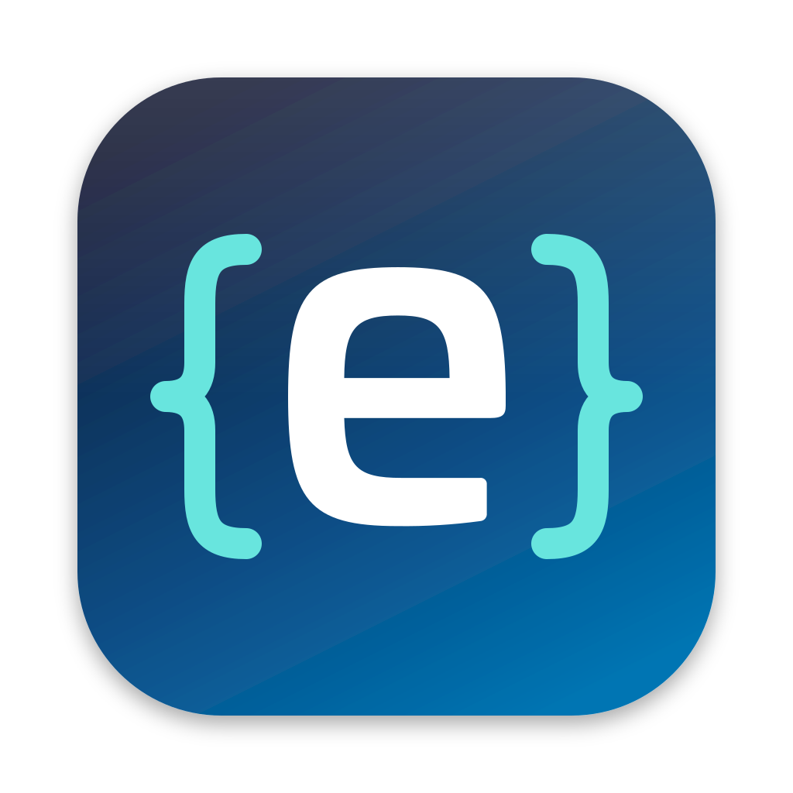

<h1 align="center">esveo code</h1>

  esveo's fork of <a href="https://github.com/pingdotgg/t3code">T3 Code</a>, the harness harness for Claude Code, Codex and more.

  <a href="#getting-started">Getting started</a> ·
  <a href="#features">Features</a> ·
  <a href="docs/fork/changelog.md">Changelog</a> ·
  <a href="https://github.com/pingdotgg/t3code">Upstream</a>

## Getting started

Setting up the app, the server and your clients is described in [docs/fork/setup.md](docs/fork/setup.md).

## Features

### Split view

Drag a thread next to the one you have open.

  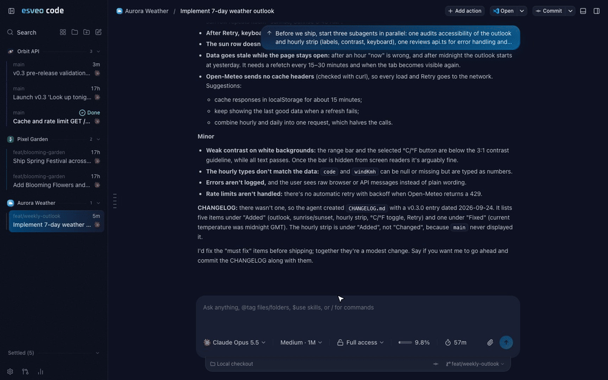

### Git graph

The repository's commit graph in the side panel. Click a commit to see its diff, or <kbd>⌘</kbd>-click a second one to diff the range.

  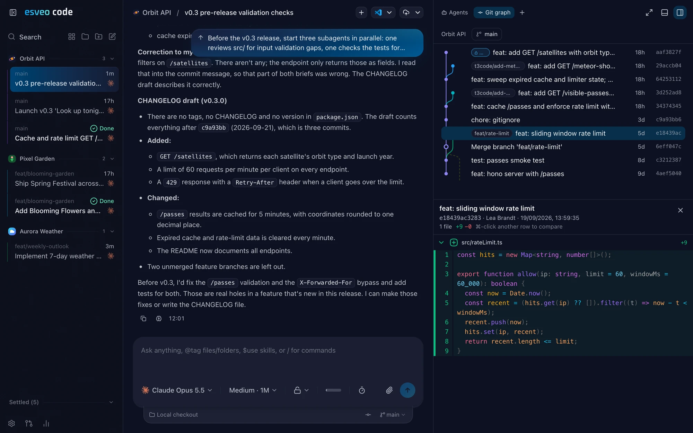

### Context, cost and cache

The composer shows context usage, the thread's cost and how long the prompt cache stays warm.

<table>
  <tr>
    <td width="33%">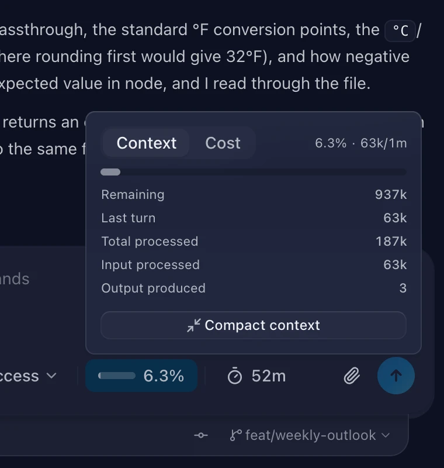</td>
    <td width="33%">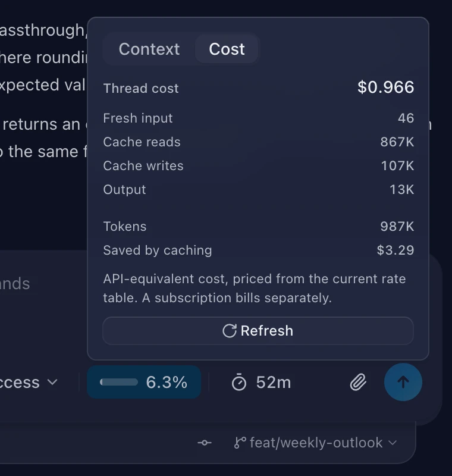</td>
    <td width="33%">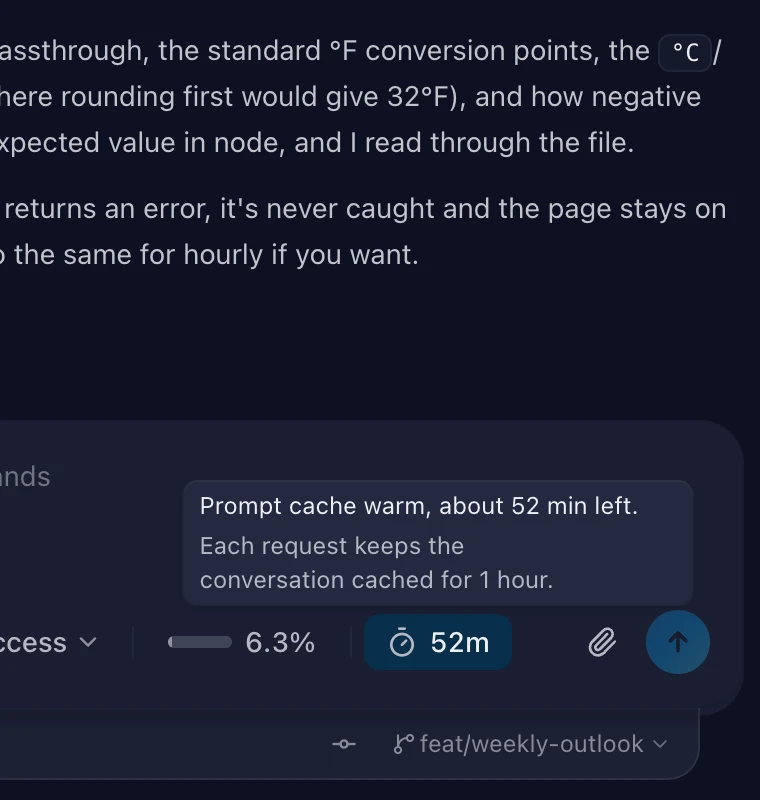</td>
  </tr>
</table>

### Subagent chats

The Agents panel lists every subagent. Click one to open its chat, live while it runs.

  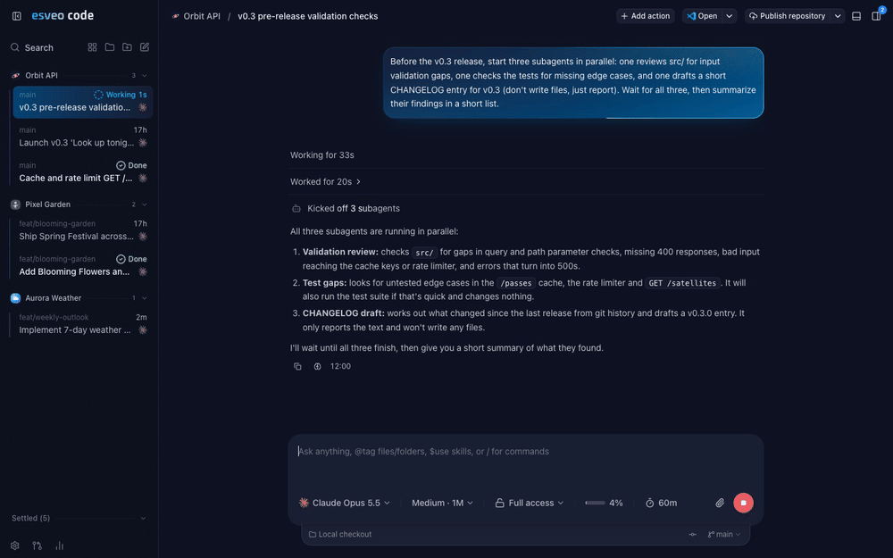

### Thread orchestration

A coordinator thread starts child threads in any project, waits for them and collects their results.

  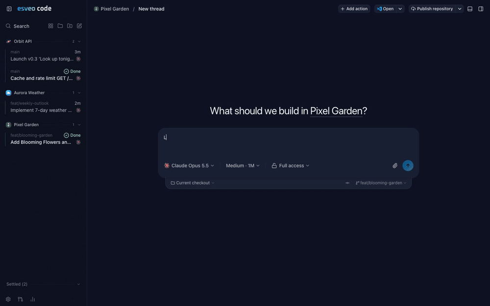

### Agent stage

Watch every agent move between thinking, reading, editing, terminal and subagents.

  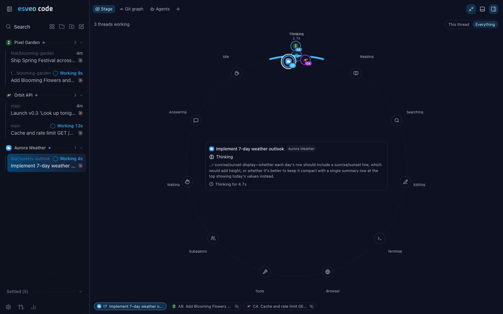

### Thought trail

Read back the thinking behind any answer.

  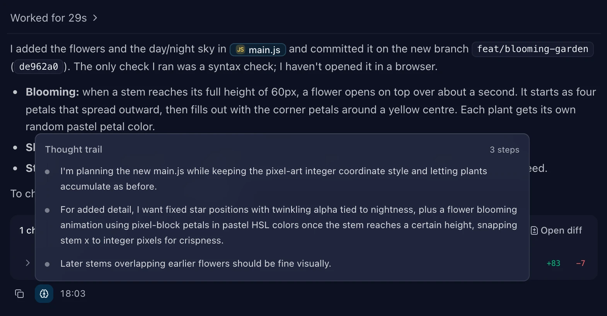

### esveo themes

_esveo_ and _esveo Midnight_, each in light and dark.

  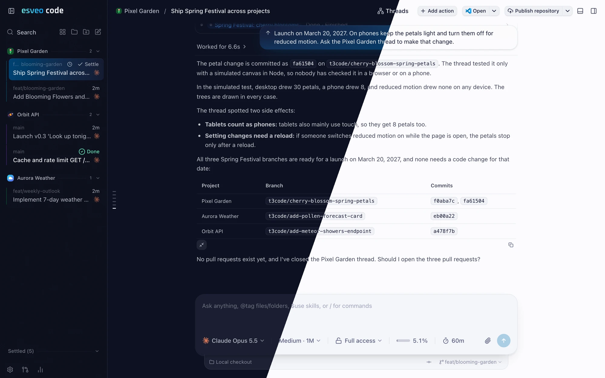

### And more

- Threads, subagents and workflows survive a server restart.
- Two-line thread cards, grouped by project.
- Prompts lost to an early interrupt carry over to the next turn.
