<p align="center">
  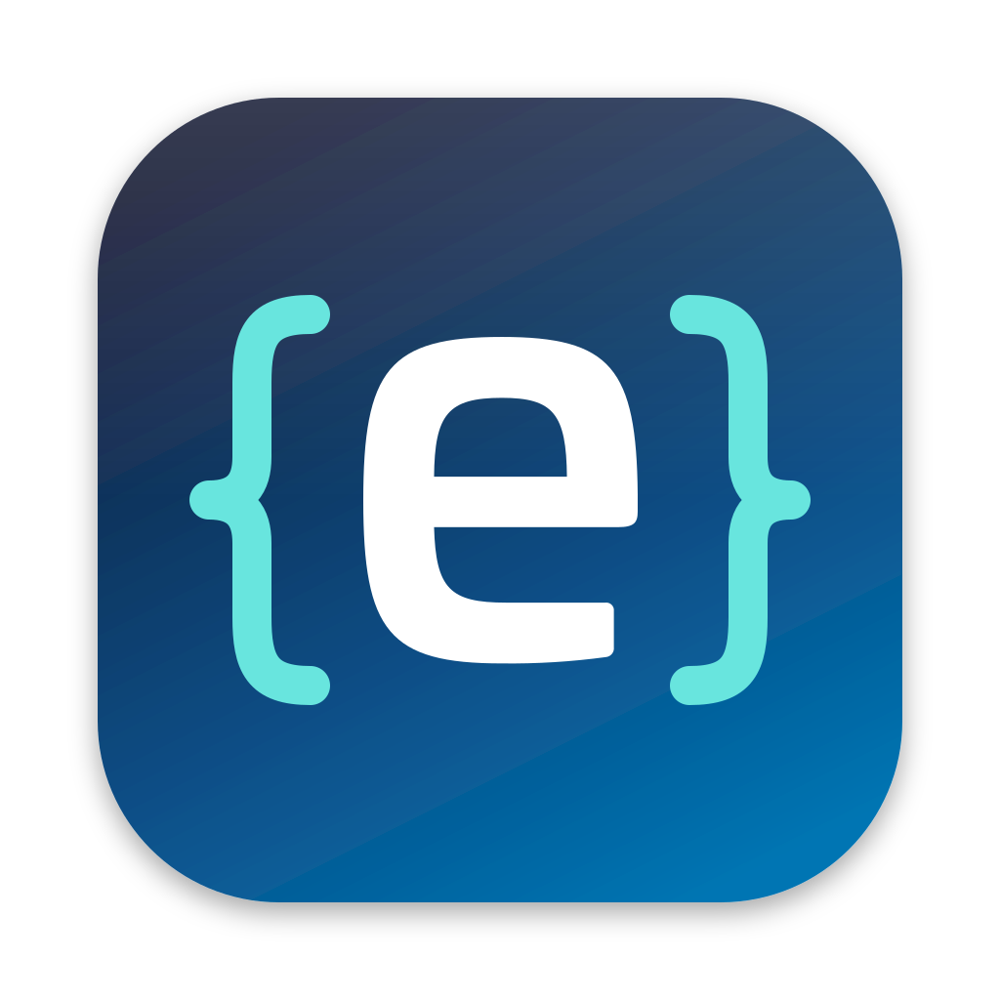
</p>

<h1 align="center">esveo code</h1>

<p align="center">
  esveo's fork of <a href="https://github.com/pingdotgg/t3code">T3 Code</a>, the harness harness for Claude Code, Codex and more.
</p>

<p align="center">
  <a href="#getting-started">Getting started</a> ·
  <a href="#features">Features</a> ·
  <a href="docs/fork/changelog.md">Changelog</a> ·
  <a href="https://github.com/pingdotgg/t3code">Upstream</a>
</p>

## Getting started

Setting up the app, the server and your clients is described in [docs/fork/setup.md](docs/fork/setup.md).

## Features

### Split view

Drag a thread next to the one you have open.

<p align="center">
  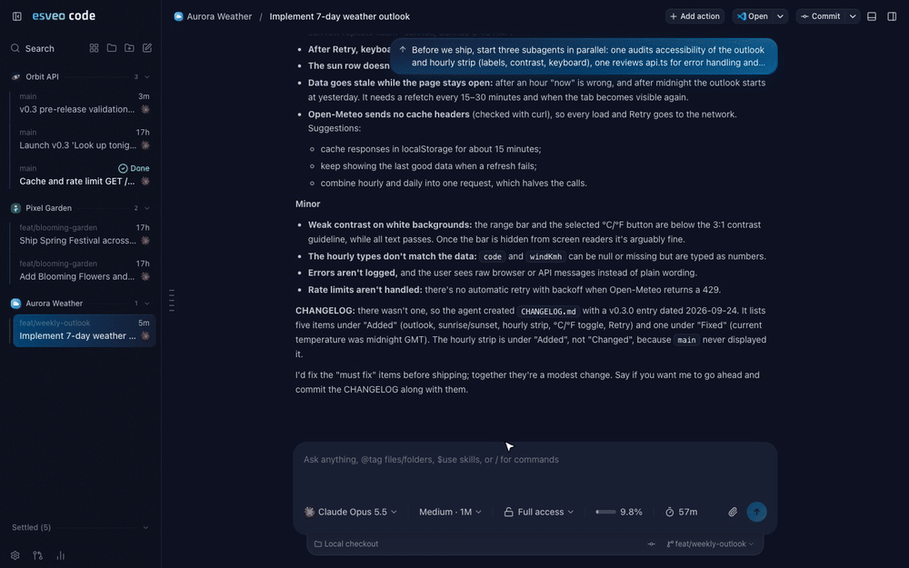
</p>

### Git graph

The repository's commit graph in the side panel. Click a commit to see its diff, or <kbd>⌘</kbd>-click a second one to diff the range.

<p align="center">
  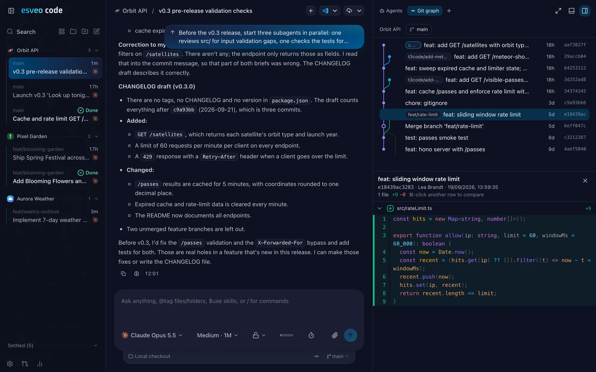
</p>

### Context, cost and cache

The composer shows context usage, the thread's cost and how long the prompt cache stays warm.

<table>
  <tr>
    <td width="33%">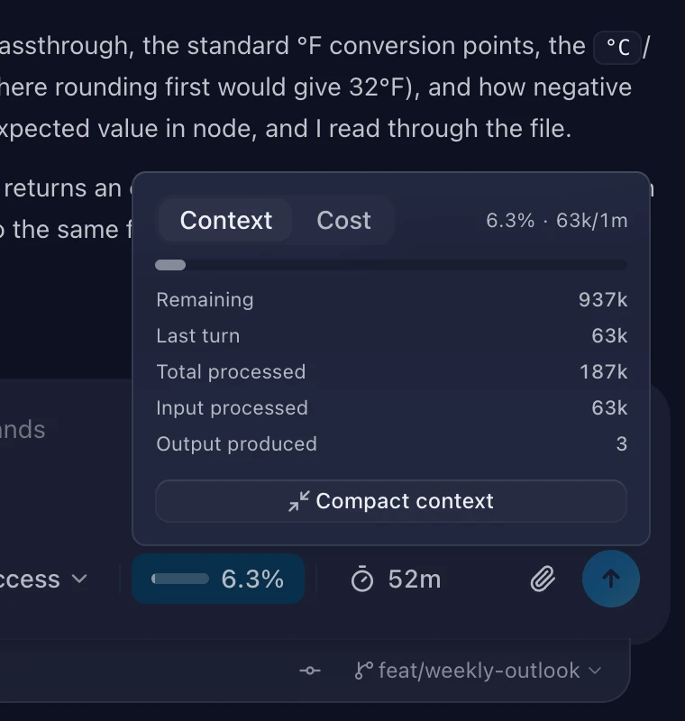</td>
    <td width="33%">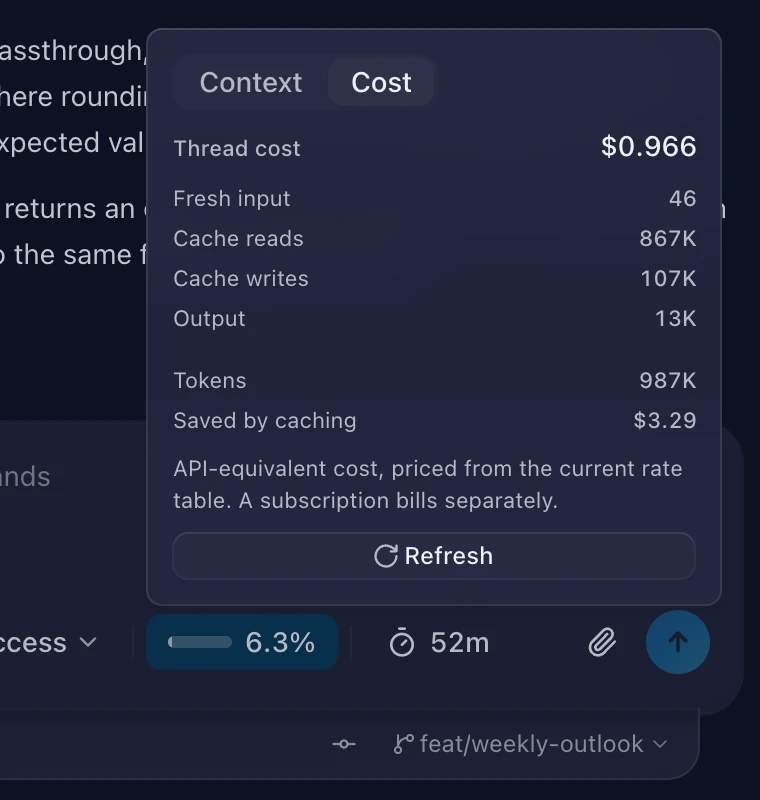</td>
    <td width="33%">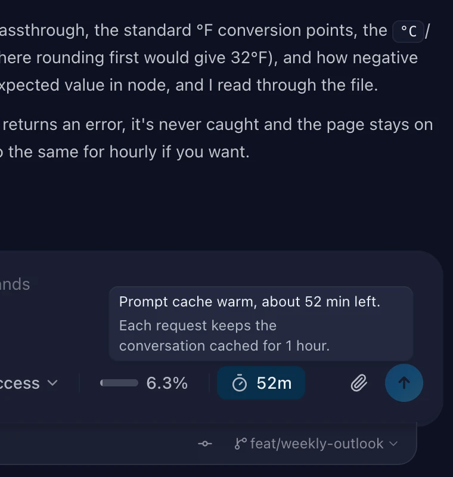</td>
  </tr>
</table>

### Subagent chats

Every subagent opens as its own thread, live while it runs. From there you can send it a message through the main agent, and stop a Claude subagent.

### Thread orchestration

A coordinator thread starts child threads, waits for them and collects their results. Existing threads can be moved under a coordinator, to another one, or released again. To let it start and reach threads in other projects too, turn on Cross-project threads in Settings → General.

<p align="center">
  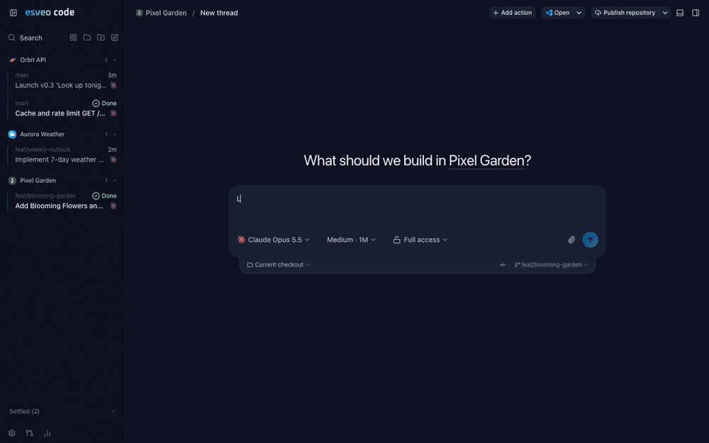
</p>

### Agent stage

Watch every agent move between thinking, reading, editing, terminal and subagents.

<p align="center">
  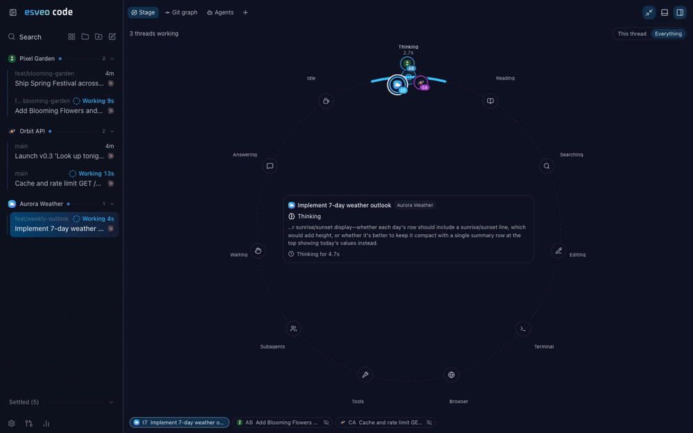
</p>

### Thought trail

Read back the thinking behind any answer.

<p align="center">
  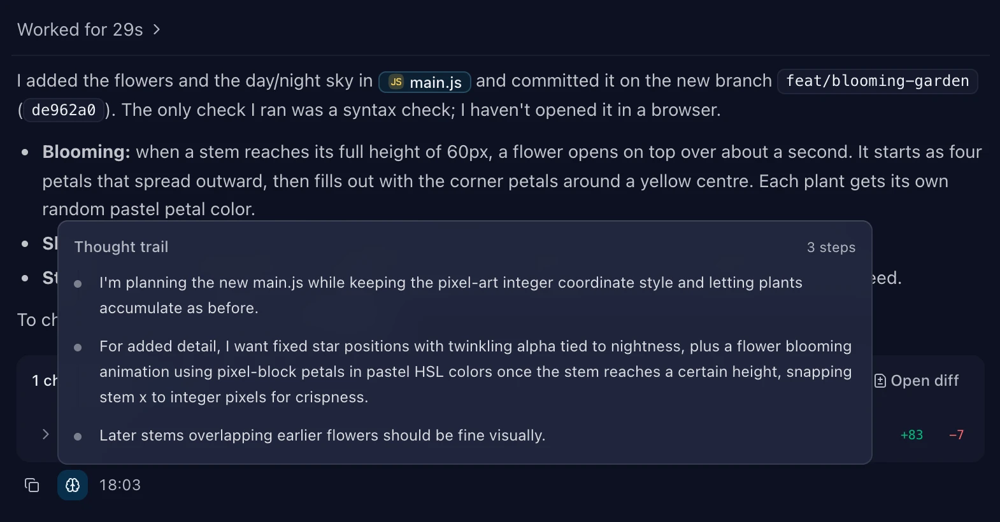
</p>

### Dictation

Speak into the composer with the microphone button or <kbd>⌘</kbd><kbd>⇧</kbd><kbd>Space</kbd>. Whisper transcribes on the machine that runs the server, in German and English, and no audio leaves it. Turn it on under Settings → General → Voice input; Android phones and older iPhones then dictate through the same model.

<p align="center">
  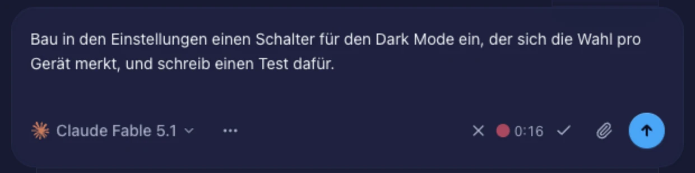
</p>

### esveo themes

_esveo_ and _esveo Midnight_, each in light and dark.

<p align="center">
  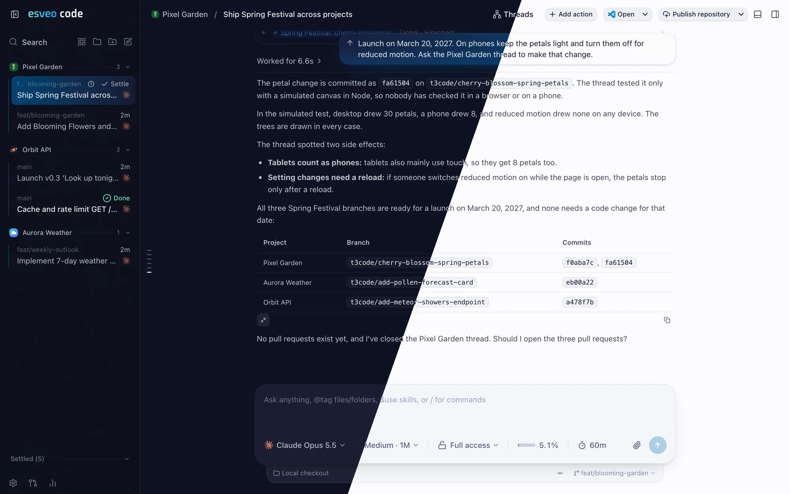
</p>

### And more

- A Notes tab in the right panel for notes and todos per thread, per project and globally: capture with <kbd>⌥</kbd><kbd>⌘</kbd><kbd>K</kbd>, drag to sort or tick off, and insert a note into the composer in one click.
- Runs on upstream's Orchestrator V2 ahead of upstream's own release: fork a thread from any answer, switch provider mid-thread, attach threads as context, scheduled tasks, and usage limits that resume by themselves. Your chats are backed up before the one-time move to it.
- Threads, subagents and workflows survive a server restart.
- Two-line thread cards, grouped by project.
- Prompts lost to an early interrupt carry over to the next turn.
- [Install and first run](./docs/user/install.md)
- [Permission modes](./docs/user/permission-modes.md)
- [Keyboard shortcuts](./docs/user/keybindings.md)
- [Project settings](./docs/user/project-settings.md)
- [Appearance preferences](./docs/user/appearance.md)
- [Remote access from a phone or another machine](./docs/user/remote-access.md)
- [Connect Claude Code, Codex, ChatGPT and other agents over MCP](./docs/user/outside-agents.md)
- [Keeping app and server in sync](./docs/user/updating.md)
- [Source control integrations](./docs/user/source-control.md)
- Multiple accounts: [Codex](./docs/user/providers-codex.md) · [Claude](./docs/user/providers-claude.md)
- [Run T3 Code as a background service](./docs/user/background-service.md)

Building from source? Start at [docs/internals/overview.md](./docs/internals/overview.md).

## If you REALLY want to contribute still.... read this first

### Install `vp`

T3 Code uses Vite+ so you'll need to install the global `vp` command-line tool.

#### macOS / Linux

```bash
curl -fsSL https://vite.plus | bash
```

#### Windows

```bash
irm https://vite.plus/ps1 | iex
```

Checkout their getting started guide for more information: https://viteplus.dev/guide/

### Install dependencies

```bash
vp i
```

Read [CONTRIBUTING.md](./CONTRIBUTING.md) before reporting a bug or opening a PR.

Have a feature request? Start an [Ideas discussion](https://github.com/pingdotgg/t3code/discussions/categories/ideas).

Need support? Join the [Discord](https://discord.gg/jn4EGJjrvv).
